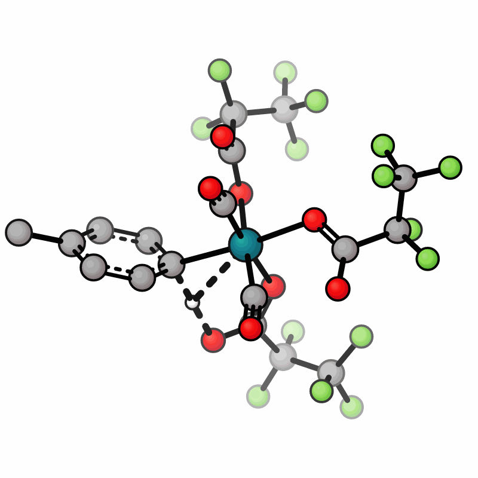

# Benchmarking-DE-TS-MLIPs

  

TS of Rhodium-catalyzed oxidative carbonylation of toluene as found by the ML-FSM with UMA-M. gif made with [xyzrender](https://github.com/aligfellow/xyzrender)

## Description
This repository contains the input geometries and scripts for the paper *Reliable and Efficient Automated Transition-State Searches with Machine-Learned Interatomic Potentials.*

## Software and Models
* [ML-FSM](https://github.com/thegomeslab/ML-FSM)
* [Sella](https://github.com/zadorlab/sella)
* [ASE](https://gitlab.com/ase/ase)
* [FAIRChem](https://github.com/facebookresearch/fairchem)
* [MACE](https://github.com/acesuit/mace)
* [AIMNet2](https://github.com/isayevlab/AIMNet2)
* [GFN2-xTB](https://github.com/grimme-lab/xtb)
